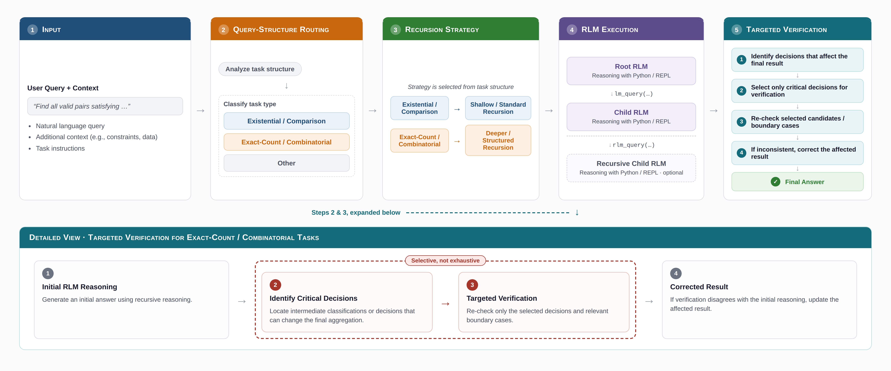

<h1 align="center" style="font-size:2.4em">
<span>Informed Recursion for Recursive Language Models (<span style="color:orange">RLM</span>s)</span>
</h1>

<p align="center" style="font-size:1.15em">
<b>Official Anonymous Submission Repository for ICLR</b>
</p>

<p align="center">
  
</p>

## Overview

**Recursive Language Models (RLMs)** offer a task-agnostic inference paradigm that enables language models to examine, decompose, and recursively process near-infinite contexts via a programmatic Read-Eval-Print Loop (REPL) environment.

However, a closer look at RLM performance reveals a sharp accuracy gap by task type: strong performance on existential and comparison queries, but a substantial drop on tasks that require an exact numerical count or combinatorial aggregation. We trace this to a specific failure mode:

1. **Error amplification under combinatorial aggregation**: on tasks requiring pair formation or relational reasoning over long contexts (e.g., OOLONG-Pairs), ordinary classification errors near category boundaries — which existential queries can absorb — get amplified once those decisions feed into pairwise or exact-count aggregation.
2. **Unnecessary recursion on flat lookups**: on tasks where local evidence from a small, fixed region of the context is already sufficient (e.g., CodeQA-style repository lookups), forcing deeper recursion can hurt rather than help.

### The Informed Recursion Framework

To address this, this repository implements **Informed Recursion**, a single-trajectory approach combining two lightweight mechanisms:
* **Query-Structure Routing**: inspects the structure of the query before context processing and selects a recursion depth ($d \in \{0, 1, 2\}$) suited to that query, rather than using a single fixed depth for every task.
* **Targeted Verification**: after the initial reasoning trajectory completes, selectively re-checks only the intermediate decisions that can materially affect the final aggregation (e.g., borderline classifications or conflicting evidence), and updates the result when verification disagrees with the initial reasoning. This is a single-pass, post-hoc check — not a runtime intercept — to keep the added inference cost bounded.

Across our evaluations, Informed Recursion improves OOLONG-Pairs Overall F1 from 52.55% (vanilla RLM, Depth-0) to 78.31% — a gain of **+25.76 F1 points** (+49.0% relative) — with the largest gains concentrated on the hybrid, non-monotonic-predicate cohort (40.50% → 71.15%, **+30.65 F1 points**), while doing so at roughly the same per-task API cost as the Depth-1 baseline. See Tables 2–3 in the paper for the full breakdown across benchmarks and ablations.

---

## Repository Structure

```text
informed-recursion-iclr/
├── rlm/                      # Core Recursive Language Model library
│   ├── clients/              # Multi-backend LLM clients (OpenAI, Anthropic, Gemini, Portkey)
│   ├── core/                 # RLM engine, execution loop, subcall dispatch
│   ├── environments/         # Execution environments (Local REPL, Docker, Daytona, Modal, etc.)
│   ├── guardrails/           # Query-Structure Routing & Targeted Verification
│   ├── logger/               # Structured execution trajectory loggers
│   └── utils/                # Token utils, contract prompts, output parsing
├── research/
│   └── eval/                 # Official benchmark evaluation harnesses
│       ├── codeqa.py                 # LongBench-v2 CodeQA loader & scorer
│       ├── oolong.py                 # OOLONG single-document evaluation (131K, Table 2)
│       ├── oolong_pairs.py           # OOLONG-Pairs combinatorial aggregation evaluation (Table 2 & 3)
│       ├── run_browsecomp.py         # BrowseComp-Plus 150-query held-out generalization runner
│       ├── run_scaling_sweep.py      # Context-length scaling sweep runner
│       ├── run_phase_b_codeqa.py     # CodeQA evaluation with routing/verification ablations
│       ├── run_phase_b_longcot.py    # LongCoT-mini multi-domain evaluation (Table 4)
│       └── longcot_verifier/         # Self-contained programmatic verifiers for LongCoT
├── examples/                 # Minimal standalone usage examples
│   ├── informed_recursion_example.py # Basic Informed Recursion pipeline
│   ├── quickstart.py                 # Basic RLM search quickstart
│   └── custom_tools_example.py       # Custom tools integration
├── data/                     # Evaluation datasets and contexts
├── media/                    # Figures and architectural diagrams
└── tests/                    # Unit and regression test suite
```

> **Scope note.** This library supports multiple backends, execution sandboxes, and context lengths for general use. The paper's reported numbers (Tables 2–5) use exactly one configuration throughout: a single model, a single sandboxed Python REPL environment, and the context sizes stated per benchmark (64K for OOLONG-Pairs, 131K for OOLONG, and the fixed per-instance file sets for CodeQA). See "Reproducing Paper Results" below for the exact commands and configuration used to generate each table.

---

## Installation & Quickstart

### Prerequisites
- Python **3.11** or later.

### Setup

```bash
git clone <repository-url>
cd informed-recursion-iclr
pip install -e .
```

For evaluation dependencies (datasets, pyarrow):
```bash
pip install -e ".[eval]"
```

### Environment Configuration

All results in the paper were produced using **GPT-5.6-Luna via Azure OpenAI**. Configure credentials accordingly:

```bash
# Paper configuration: Azure OpenAI
export AZURE_OPENAI_API_KEY="your-api-key"
export AZURE_OPENAI_ENDPOINT="https://your-resource.openai.azure.com/"
export OPENAI_MODEL_NAME="gpt-5.6-luna"

# Other supported backends (not used for reported results):
# export OPENAI_API_KEY="your-api-key"          # OpenAI / OpenAI-compatible
# export ANTHROPIC_API_KEY="your-anthropic-key" # Anthropic
# export VERTEX_PROJECT_ID="your-project-id"    # Google Vertex AI
# export VERTEX_MODEL="gemini-1.5-pro"
```

<!-- TODO(authors): confirm these two kwargs match the actual RLM() signature —
     paper §5.3 specifies Medium reasoning effort for the root agent and Low
     for recursive sub-agents; rename below if the library uses different
     field names. -->

---

## Using Informed Recursion

You can enable Informed Recursion by passing `enable_routing=True` and `enable_verification=True` during initialization:

```python
from rlm import RLM

# Instantiate RLM with Informed Recursion (Query-Structure Routing + Targeted Verification),
# matching the paper's reported configuration (Section 5.3).
rlm = RLM(
    backend="azure_openai",
    backend_kwargs={
        "model_name": "gpt-5.6-luna",
        "root_reasoning_effort": "medium",     # paper: Medium effort, root agent
        "subcall_reasoning_effort": "low",     # paper: Low effort, recursive sub-agents
    },
    environment="local",
    max_depth=2,                # allows up to depth-2 recursion when routing selects it
    enable_routing=True,        # Query-Structure Routing
    enable_verification=True,   # Targeted Verification
    routing_mode="rules",       # rule-based predicate-topology routing
    verbose=True,
)

context = "Your massive document collection, repository code, or book text..."
query = "Identify all pairs of entities that co-occur across distinct sections with property X."

completion = rlm.completion(
    prompt=context,
    root_prompt=query,
)

print(completion.response)

# Inspect trajectory and mechanism metadata
if completion.metadata and "routing_verification" in completion.metadata:
    meta = completion.metadata["routing_verification"]
    print("Routed depth:", meta.get("assigned_depth"))
    print("Verification triggered:", meta.get("verification_fired"))
```

A complete runnable example is available at [`examples/informed_recursion_example.py`](examples/informed_recursion_example.py).

---

## Reproducing Paper Results

All benchmark evaluations reported in the paper can be executed using the standalone scripts in `research/eval/`. Each command below uses the paper's exact configuration (GPT-5.6-Luna, Azure OpenAI, Medium/Low reasoning effort).

### 1. OOLONG-Pairs 64K (Table 2 & Table 3)
```bash
python -u research/eval/oolong_pairs.py --backend azure_openai --model-name gpt-5.6-luna
```

### 2. OOLONG 131K Single-Document (Table 2)
```bash
python -u research/eval/oolong.py --backend azure_openai --model-name gpt-5.6-luna --context-len 131k
```

### 3. LongBench-v2 CodeQA (Table 2)
```bash
python -u research/eval/run_phase_b_codeqa.py --backend azure_openai --model-name gpt-5.6-luna
```

### 4. LongCoT-mini Multi-Domain Reasoning (Table 4)
```bash
python -u research/eval/run_phase_b_longcot.py --backend azure_openai --model-name gpt-5.6-luna
```

### 5. BrowseComp-Plus Held-Out Generalization
```bash
python -u research/eval/run_browsecomp.py --method informed_recursion --num-queries 150 --backend azure_openai --model-name gpt-5.6-luna
```

### 6. Context-Length Scaling Sweep (supplementary)
```bash
# OOLONG-Pairs with Informed Recursion, at a given context length:
python -u research/eval/run_scaling_sweep.py --benchmark pairs --context-len 64k --method informed_recursion

# OOLONG single-document with vanilla RLM Depth-1, at a given context length:
python -u research/eval/run_scaling_sweep.py --benchmark oolong --context-len 128k --method vanilla_d1
```

<!-- TODO(authors): double-check flag names (--model-name vs --model, --backend
     values, etc.) against the actual argparse definitions in each script —
     these should match exactly what was run to produce the paper's tables. -->

---

## Running Tests

Run the test suite to verify installation and mechanism correctness:

```bash
pytest tests/test_routing_verification.py
pytest tests/test_imports.py
```

<!-- TODO(authors): confirm test file name — original README referenced
     tests/test_guardrails_m1_m2.py; renamed here to match the
     Query-Structure Routing / Targeted Verification terminology used in the
     paper. Point this back at the real file name. -->

---

## Citation & Anonymous Submission

This code is provided as part of the supplementary material for anonymous review at ICLR. Please refer to the main conference paper for complete theoretical derivations and full experimental analysis.